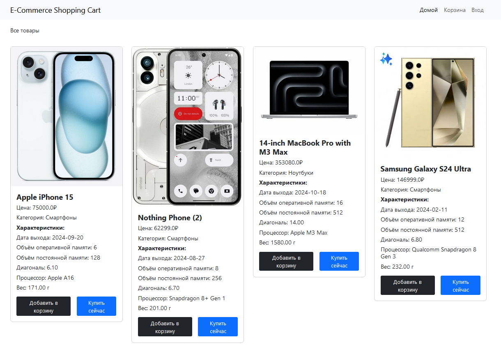
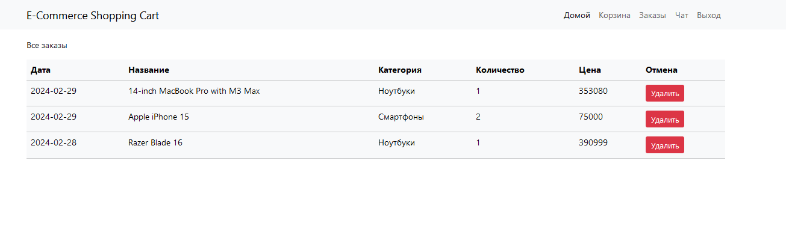
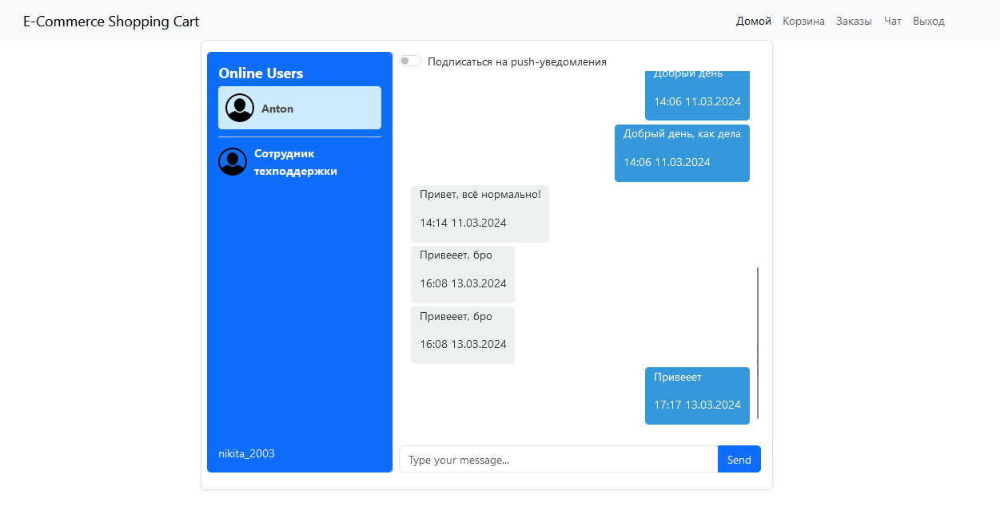

# E-commerce marketplace application

## Сборка и запуск приложения

Для того, чтобы создать базу данных и таблицу, выполните следующую команду:

`
psql -U postgres -f 'путь до проекта/script.sql'
`

Для запуска и сборки проекта выполните следующую команду в корневой папке:

`
mvn spring-boot:run
`

После окончания деплоя перейдите по адресу `http://localhost:8080/index`

По окончании работы нажмите комбинацию клавиш `Ctrl + c`, чтобы остановить сервер.

## Примеры работы

